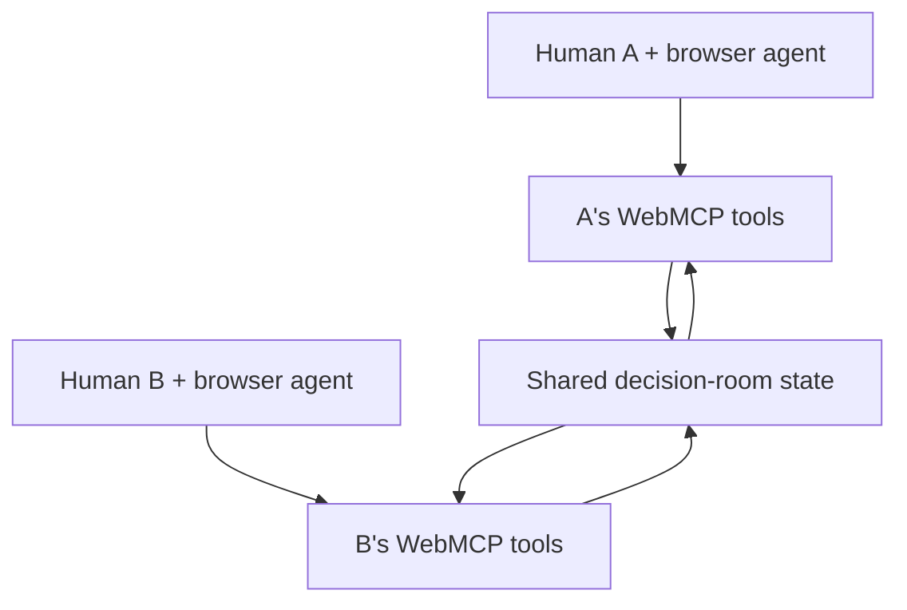
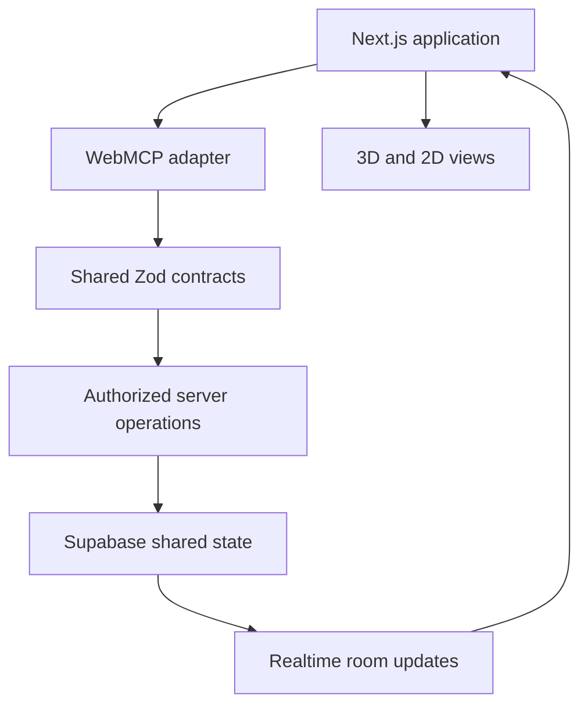

# WebMCP Hackathon Project Brief

> **Working concept:** A shared, visually immersive decision room where multiple humans collaborate through their own browser agents, negotiate conflicting constraints, and retain final control over every collective decision.
>
> **Working title:** **Consensus Office**  
> This is a placeholder. The final name should be short, memorable, and independent from the official WebMCP name.

---

## 1. Executive Summary

We are planning to enter the [WebMCP Challenge](https://webmcp.devpost.com/) with an agent-native collaborative web application.

The proposed product is a **shared decision room for remote teams**. Each participant enters a virtual office with their own browser agent. The participants and agents collaboratively contribute constraints, propose solutions, identify conflicts, negotiate trade-offs, vote, and approve a final plan.

The core product principle is:

> Agents can accelerate collaboration, but they must not erase identity, disagreement, consent, or human authority.

For the hackathon demonstration, the room will focus on one clear scenario: a cross-functional startup team agreeing on a two-week product-launch plan. The engineer, designer, product manager, and marketing lead each bring different requirements and limitations. Their agents help reconcile those constraints through structured WebMCP tools.

The application will include a polished low-poly **3D office built with React Three Fiber**. The 3D environment will not be decorative. It will make shared state and agent actions visible:

- Participant desks show who is present and what each person is doing.
- The central table contains active proposals.
- A constraint wall displays requirements.
- A conflict board shows unresolved objections.
- Visual trails show agent actions moving through the room.
- Consensus indicators show votes and missing approvals.
- The finalization area displays the plan awaiting explicit human approval.

The same information and controls will also exist in a normal accessible 2D interface. Agents interact with the semantic application model through WebMCP, not with 3D coordinates.

---

## 2. What the Hackathon Requires

This is not a general “build an AI web app” competition. The website itself must expose meaningful, structured browser tools using WebMCP. An agent visiting the deployed application must be able to discover and call those tools to complete a useful workflow.

The expected product should include:

1. A normal, usable human-facing website.
2. Multiple well-designed WebMCP tools.
3. A meaningful workflow requiring several tool calls or shared state.
4. Visible changes in the interface when tools are used.
5. Clear human confirmation before sensitive or irreversible actions.
6. A polished, reliable start-to-finish demonstration.

The four judging categories are equally weighted:

| Criterion | What judges are evaluating | What our project must demonstrate |
|---|---|---|
| **WebMCP Leverage** | Whether WebMCP is used meaningfully and non-trivially | Specialized tools, dynamic availability, structured schemas, multi-step workflows, shared state, errors, and permission boundaries |
| **Execution** | Whether the application is coherent, reliable, polished, and complete | A stable live deployment, intuitive onboarding, accessible UI, strong testing, clear documentation, and a complete workflow |
| **Potential Impact** | Whether the project solves a real problem for a specific audience | A credible problem in remote collaboration: lost constraints, unclear responsibility, weak decision records, and meetings that fail to produce agreement |
| **Creativity & Ambition** | Whether the concept and interaction model are original and technically ambitious | Multiple humans and browser agents negotiating in a shared environment, with visible state, consent, and collective authority |

WebMCP Leverage is especially important because it is also the first tie-breaker.

### Submission requirements

Our final submission must include:

- A working live URL that can be opened in the supported WebMCP environment.
- A public GitHub, GitLab, or Bitbucket repository.
- A visible open-source license.
- All source code, assets, dependencies, setup instructions, and testing instructions.
- An English project description explaining:
  - Why the problem is suited to WebMCP.
  - How WebMCP improves the user experience.
  - What humans and agents can accomplish together.
  - How WebMCP was implemented.
- A public YouTube demo video shorter than three minutes, with audio.
- Working judge credentials if authentication is required.

The deadline is **September 3, 2026 at 1:00 PM PDT**, corresponding to **September 3 at 23:00 in Türkiye**. We should submit earlier and leave time to verify the live deployment.

Official references:

- [Challenge page](https://webmcp.devpost.com/)
- [Official rules and judging criteria](https://webmcp.devpost.com/rules)
- [Chrome WebMCP documentation](https://developer.chrome.com/docs/ai/webmcp)
- [Secure WebMCP tool guidance](https://developer.chrome.com/docs/ai/webmcp/secure-tools)
- [WebMCP evaluation guidance](https://developer.chrome.com/docs/ai/webmcp/evals)

---

## 3. Why This Concept Fits the Jury

The jury’s shared public interests suggest that a strong project should demonstrate the emerging architecture of an agent-native web rather than merely adding an AI chat box to a normal application.

The relevant recurring themes are:

1. Browser-native agent interaction.
2. Open standards and interoperability.
3. Human-agent collaboration.
4. User control and explicit consent.
5. Local or private personal state.
6. Observable and understandable agent actions.
7. Reliable multi-tool workflows.
8. Measurable Agent Experience.
9. Clear errors and recovery paths.
10. A credible real-world transaction or decision.

These are evidence-based inferences from the judges’ public work, not assumptions about how any individual will score the submission.

| Judge | Relevant public interests | Design implication for us |
|---|---|---|
| **Sarah Drasner** | AI web ecosystem, composability, standards, security, privacy, and observability | Every agent action should be visible, understandable, and permissioned |
| **Andrew Galloni** | An open agentic internet in which sites are readable, discoverable, callable, and transact safely | Use explicit tool contracts, structured outputs, and genuine shared actions |
| **Alex Nahas** | Browser MCP interoperability, local-first software, sync systems, WebAI, and on-device experiences | Include meaningful local/private state and browser-native implementation |
| **Ilya Grigorik** | Agentic commerce, constraints, qualification, negotiation, extensibility, and human handoff | Demonstrate multi-stage negotiation and final human approval |
| **Jude Gao** | Agent-first Next.js, developer tooling, performance, and agent evaluations | Build clean architecture, excellent documentation, fast UI, and tool-selection evals |
| **Sean Roberts** | Agent Experience, discoverability, reliable calling, errors, recovery, and team workflows | Treat agents as real product users and measure task completion |
| **Justin Rushing** | Browser agents, browser integrations, and controlled access | Ensure the product works cleanly inside the target browser-agent environment while preserving user control |

The purpose is not to “judge-bait.” The goal is to build a product that genuinely embodies the future of the collaborative agent-native web these judges are already helping shape.

---

## 4. The Problem

Remote teams frequently make important decisions across meetings, direct messages, documents, project boards, and informal conversations. This causes several recurring problems:

- Individual constraints are forgotten or never recorded.
- The loudest participant can dominate the final result.
- Minority objections disappear from the decision history.
- Teams confuse a vote with final consent.
- People agree on an idea without agreeing on the implementation plan.
- Action items lose ownership and deadlines.
- Later, nobody remembers why a decision was made.
- Existing AI assistants generally represent one user, not the collective authority of a group.

Existing meeting software helps people communicate. Existing personal agents help one person act. Neither is designed for a room in which **every participant has an agent, each identity remains separate, and collective decisions require explicit human authority**.

### Target users

The initial target audience is small remote product teams:

- Early-stage startups.
- Student startup teams.
- Cross-functional product squads.
- Remote project groups.
- Hackathon teams.

The underlying decision engine could later support travel planning, hiring committees, apartment selection, event planning, procurement, grant-review panels, and other multi-party decisions.

---

## 5. Product Vision

### Core pitch

> Existing meeting tools let people talk. Existing agent tools help one person act. Consensus Office gives every participant an agent while preserving identity, consent, disagreement, and collective authority.

### Hackathon scenario

A startup team must agree on a two-week launch plan:

- The **engineer** has capacity, dependency, and security constraints.
- The **designer** is responsible for accessibility and visual coherence.
- The **product manager** represents customer needs and feature priorities.
- The **marketing lead** has a fixed launch date and campaign commitments.

Each participant joins the same room in a separate browser session. Each session is tied to one participant identity. The participant’s agent can only act within that identity’s permissions.

Together, participants and agents:

1. Read the shared decision brief.
2. Add public constraints.
3. Save private constraints locally.
4. Evaluate ideas against private constraints without automatically disclosing them.
5. Submit proposals.
6. Detect conflicts between proposals and constraints.
7. Offer concrete trade-offs.
8. Revise proposals.
9. Vote, veto, or request changes.
10. Preview the final decision and action plan.
11. Ask every required human for independent approval.
12. Produce an auditable decision record.

---

## 6. How WebMCP Enables the Product

WebMCP does not directly make agents communicate with one another. Each participant’s browser agent calls tools registered by the page in that participant’s browser. The shared application server mediates the collaboration.



This distinction should be stated honestly in the README and video. We are creating a multi-participant agent workflow through shared state; we are not claiming that WebMCP itself is an agent-to-agent messaging protocol.

### Why ordinary DOM automation is not enough

Without WebMCP, an agent must inspect buttons, forms, labels, visual cards, and changing page state and then guess how to complete the workflow. In a collaborative decision room, this would be fragile and unsafe.

WebMCP allows the application to expose semantic actions such as:

- “Add my constraint.”
- “Evaluate this proposal.”
- “Offer a trade-off for this specific conflict.”
- “Cast my vote.”
- “Preview the final decision.”
- “Approve only for my participant identity.”

Each tool has a strict input schema, a clear permission boundary, structured output, and a visible effect in the shared interface.

---

## 7. Decision-Room State Machine

The room moves through explicit phases. Available WebMCP tools change with the current phase. Tools that no longer make sense are unregistered.

| Phase | Human experience | WebMCP tools available |
|---|---|---|
| **Lobby** | Join a room and select or receive a participant role | `join_decision_room`, `get_room_info` |
| **Briefing** | Read the problem and contribute requirements | `get_decision_brief`, `add_my_constraint`, `list_constraints` |
| **Proposals** | Create and revise candidate solutions | `submit_proposal`, `revise_my_proposal`, `list_proposals` |
| **Deliberation** | Evaluate proposals, identify conflicts, and negotiate | `evaluate_proposal`, `get_conflict_map`, `offer_tradeoff` |
| **Voting** | Vote, veto, abstain, or request changes | `cast_my_vote`, `request_revision`, `get_vote_status` |
| **Approval** | Preview the final decision and independently confirm it | `preview_final_decision`, `approve_final_decision` |
| **Finalized** | View and export the immutable decision record | `get_decision_record`, `export_action_plan` |

Examples of dynamic behavior:

- A participant cannot vote before the room enters the voting phase.
- Proposal submission tools disappear after voting begins.
- The final approval tool does not appear until the proposal passes validation.
- Finalization occurs only after every required participant separately approves.
- After finalization, mutating decision tools are unregistered.

Dynamic registration is one of the clearest ways to show that WebMCP is part of the application architecture rather than a thin wrapper around existing buttons.

---

## 8. Proposed WebMCP Tool Set

The final MVP should expose approximately six to nine excellent tools in the primary demonstrated path. More tools are not automatically better. Reliability and clear responsibilities matter more than quantity.

| Tool | Responsibility | Type and trust model | Visible effect |
|---|---|---|---|
| `get_decision_brief` | Return the goal, deadline, roles, and success conditions | Read-only | Opens or highlights the room brief |
| `add_my_constraint` | Add a public constraint for the active participant | Write; participant-scoped; untrusted input | Adds a card to the constraint wall |
| `submit_proposal` | Submit a concrete solution with rationale and expected outcomes | Write; participant-scoped; untrusted input | Moves a proposal card to the central table |
| `evaluate_proposal` | Evaluate one proposal against selected shared constraints | Read-only or derived write, depending on persistence | Highlights satisfied and violated constraints |
| `get_conflict_map` | Return unresolved conflicts and their evidence | Read-only | Opens the conflict board and draws relations |
| `offer_tradeoff` | Propose a specific change that addresses one identified conflict | Write; participant-scoped; untrusted input | Adds a revision card and updates the conflict visualization |
| `cast_my_vote` | Vote, veto, abstain, or request revision for the current participant | Sensitive write; idempotent; participant-scoped | Updates the participant’s status indicator |
| `preview_final_decision` | Return the plan, unresolved issues, owners, deadlines, and required approvals | Read-only | Moves the candidate plan to the finalization area |
| `approve_final_decision` | Approve the final plan only for the active human identity | Sensitive write; explicit confirmation | Turns that participant’s approval indicator green |
| `get_decision_record` | Return the finalized decision, rationale, dissent, actions, and signatures | Read-only | Opens the final record |

### Optional local privacy tools

| Tool | Responsibility | Storage and disclosure |
|---|---|---|
| `save_private_constraint` | Save a private limitation or preference | Stored locally in IndexedDB; never sent to the room by default |
| `evaluate_proposal_for_me` | Compare a proposal with local private constraints | Runs locally and returns a private result |
| `publish_constraint_summary` | Publish a user-approved summary of selected private information | Explicit disclosure from local state to shared state |

The local privacy flow would be technically distinctive, but it should be included only after the core shared decision path is stable.

### Tool-design standards

Every tool should:

- Have exactly one clear responsibility.
- Use a concise, intuitive name.
- Have an unambiguous description.
- Use strict JSON Schema types, required fields, enums, limits, and `additionalProperties: false` where appropriate.
- Validate inputs again on the server for shared-state mutations.
- Return compact, structured output.
- Update the visible UI.
- Respect cancellation for long-running work.
- Distinguish validation, authorization, stale-state, and temporary-service errors.
- Mark read-only behavior with `readOnlyHint` where supported.
- Mark externally sourced or participant-generated content with `untrustedContentHint` where supported.
- Require explicit user confirmation for approval, finalization, and other sensitive actions.

Suggested output limits should follow current Chrome guidance: keep tool names concise, descriptions focused, parameter descriptions short, and outputs compact enough for reliable agent use.

---

## 9. Identity, Consent, and Authority

The application must preserve the difference between assistance and authority.

### Identity rules

- Each browser session belongs to one authenticated participant.
- An agent inherits only that participant’s application permissions.
- A participant may add or edit only their own constraints, proposals, votes, and approval.
- An agent cannot vote or approve on behalf of another participant.
- The server, not the browser, enforces these rules.

### Consent rules

- A vote is not the same as final approval.
- Final approval is requested only after the complete decision and action plan are visible.
- Approval is recorded separately for each participant.
- The application never infers approval from silence, an earlier vote, or an agent-generated message.
- Private constraints remain local until the participant intentionally publishes a summary.

### Concurrency rules

Each room has a monotonically increasing version number. Mutating tools send the version they observed.

If another participant changes the room first, the stale action receives a structured response such as:

```json
{
  "error": "STALE_ROOM_STATE",
  "observedVersion": 12,
  "currentVersion": 13,
  "recovery": "Refresh the room state, reconsider the latest changes, and retry if still appropriate."
}
```

This prevents agents from accidentally overwriting newer decisions.

---

## 10. Making the 3D Office Functional

The 3D office is valuable only if it communicates real application state. It should allow a judge to understand what agents are doing without opening developer tools.

| 3D element | Semantic meaning |
|---|---|
| **Participant desks** | Human-agent pairs, roles, presence, activity, vote, and approval status |
| **Central meeting table** | Active proposals and revisions |
| **Constraint wall** | Shared product, engineering, design, accessibility, time, and business requirements |
| **Conflict board** | Unresolved contradictions and objections |
| **Consensus indicator** | Agreement level, vetoes, missing votes, and missing approvals |
| **Activity trail** | Visible movement representing tool calls and state changes |
| **Finalization area** | The candidate plan awaiting independent approval |

### Example visual sequence

1. The engineer’s agent calls `submit_proposal`.
2. A document visually travels from the engineer’s desk to the central table.
3. The proposal appears as a card in both the 3D scene and the accessible HTML panel.
4. The designer’s agent calls `evaluate_proposal`.
5. Relevant accessibility constraints illuminate on the wall.
6. A conflict line appears between the proposal and the unmet requirement.
7. Another participant calls `offer_tradeoff`.
8. The revised proposal moves beside the original.
9. When the revision satisfies the constraint, the conflict line disappears.
10. During approval, each participant’s desk indicator turns green only after that participant confirms.

### 3D scope limits

To keep the project achievable:

- Use React Three Fiber and Drei.
- Build a small low-poly isometric office from procedural primitives where possible.
- Use fixed camera viewpoints or limited orbit controls.
- Avoid character animation systems.
- Avoid physics and collision systems.
- Avoid free walking and complex navigation.
- Avoid large imported environments.
- Lazy-load the 3D canvas.
- Limit device pixel ratio and expensive shadows.
- Respect `prefers-reduced-motion`.
- Provide a clear 2D workspace toggle.
- Keep every important value and action available in normal DOM content.

Agents should never reason about 3D coordinates. The agent uses semantic WebMCP tools; the 3D scene exists for human understanding and aesthetic impact.

---

## 11. Interface Design

The main screen can use the following layout:

- **Primary area:** The 3D office, occupying roughly two-thirds of the screen on a desktop.
- **Decision panel:** Proposal details, requirements, conflicts, and current phase.
- **Participant panel:** Roles, online status, votes, vetoes, and approvals.
- **Activity ledger:** A persistent chronological record of human and agent actions.
- **2D mode:** A full alternative workspace driven by the same underlying state.

### Activity ledger fields

Every important event should record:

- Participant identity.
- Human or agent origin.
- Tool or manual action name.
- Timestamp.
- Sanitized inputs.
- Result.
- Previous and resulting room phase or version.
- Whether confirmation was required.
- Whether the change can be undone.
- Relevant proposal, constraint, conflict, or vote identifier.

Sensitive local constraints must not be copied into the shared ledger.

The ledger is central to the product, not a debugging afterthought. It makes agent behavior observable, inspectable, and accountable.

---

## 12. Technical Architecture

### Recommended stack

- **Application:** Next.js App Router and TypeScript.
- **Validation:** Zod schemas shared between tool adapters, server actions or routes, and tests.
- **3D interface:** React Three Fiber and Drei.
- **Shared data:** Supabase Postgres.
- **Authentication:** Supabase Auth or a minimal deterministic hackathon auth layer.
- **Realtime collaboration:** Supabase Realtime.
- **Private local data:** IndexedDB through Dexie.
- **WebMCP integration:** `document.modelContext.registerTool()`.
- **Unit and integration tests:** Vitest.
- **Multi-user browser tests:** Playwright with separate browser contexts.
- **Agent evaluations:** A small version-controlled prompt and expected-tool dataset.
- **Deployment:** Vercel or another reliable deployment route already familiar to the team.

The app does not need its own chatbot or its own OpenAI API calls. ChatGPT or the compatible browser agent is the agent. Our application’s job is to expose excellent tools and maintain a shared, visible, permissioned workspace.

### Shared-state flow



### Suggested server entities

```text
decision_rooms
participants
constraints
proposals
proposal_evaluations
tradeoffs
votes
approvals
audit_events
```

Important fields include:

- Stable UUIDs.
- Room version.
- Current room phase.
- Participant owner identity.
- Creation and update timestamps.
- Idempotency keys for mutations.
- Append-only audit metadata.
- Finalization timestamp and immutable decision record.

### Architecture principle

All interfaces should use the same domain layer:

```text
Manual UI action ─┐
                  ├─> validated domain operation ─> authorized shared state
WebMCP tool call ─┘
```

This prevents manual UI behavior and WebMCP behavior from drifting apart.

---

## 13. Reliability and Evaluation

We should treat the agent as a real application user and measure whether it can complete the workflow.

### Deterministic tests

- Schemas accept valid inputs and reject invalid inputs.
- Participant authorization is enforced server-side.
- A participant cannot act for another identity.
- Repeated idempotent requests do not duplicate mutations.
- Stale room versions return structured conflict responses.
- Tools appear and disappear in the correct phases.
- Final approval cannot occur before preview.
- Finalization requires all configured approvals.
- The audit ledger receives exactly one event per committed action.
- Private local constraints do not enter shared server state.

### Multi-browser Playwright journey

1. Browser A joins as engineer.
2. Browser B joins as designer.
3. A adds a constraint and submits a proposal.
4. B sees the realtime update.
5. B evaluates the proposal and raises a conflict.
6. A offers a trade-off.
7. Both vote.
8. Both independently approve.
9. Both receive the same finalized decision record.

### Agent evaluation prompts

Create five to ten natural-language prompts testing:

- Correct tool selection.
- Correct parameter extraction.
- Correct tool ordering.
- Recovery from a stale-state response.
- Respect for authorization boundaries.
- Refusal to approve without human confirmation.
- Recognition that a conflict remains unresolved.
- Retrieval of the final record after finalization.

We should record pass/fail results and include a compact evaluation table in the README.

---

## 14. Solo Judge Mode

Judges may open only one browser session, so the product must remain understandable and impressive without requiring three people to coordinate live.

Solo mode should include:

- One real participant controlled by the judge.
- Two or three clearly labeled simulated participants.
- Deterministic scripted behaviors for simulated participants.
- Genuine WebMCP tool use for the judge’s browser agent.
- A pre-seeded product-launch brief.
- A reset button that restores the demo room.

The application must never pretend simulated participants are real agents or real people. They should be visibly labeled as demo simulations.

The video should additionally show two real browser sessions interacting with the same room. This demonstrates the actual multi-participant architecture.

---

## 15. MVP Scope

### Must have

1. Create or join a decision room.
2. Two authenticated participant identities.
3. A seeded product-launch decision brief.
4. Realtime shared state.
5. A clear room state machine.
6. Six to nine reliable WebMCP tools.
7. Constraint, proposal, conflict, trade-off, vote, and approval flow.
8. Server-enforced participant permissions.
9. Append-only activity ledger.
10. One polished low-poly 3D office.
11. A complete 2D accessible mode.
12. Multi-browser Playwright coverage.
13. Several agent-evaluation prompts.
14. Solo judge mode.
15. Public deployment, repository, license, README, and short video.

### Add only if the core is stable

- IndexedDB private constraints.
- `publish_constraint_summary` disclosure flow.
- Undoable state history.
- Declarative WebMCP form in addition to imperative tools.
- Accessibility audit report.
- Tool-call performance dashboard.
- Encrypted room export.

### Explicitly out of scope

- External travel search.
- Real purchasing or checkout.
- Real employer applications.
- Voice chat.
- Custom animated avatars.
- Physics or collision systems.
- Free-roaming 3D characters.
- CRDT implementation.
- Cross-origin WebMCP experiments.
- AI-generated 3D asset pipelines.
- Forced sponsor integrations that do not strengthen the workflow.

---

## 16. Recommended Work Plan

Because the deadline is close, development should proceed as a vertical slice rather than as separate backend, frontend, and 3D projects.

### August 28: Product contract and skeleton

- Freeze the primary user story.
- Define the room phases and transition rules.
- Define the six to nine MVP tools.
- Create shared Zod schemas.
- Create the repository, license, branch strategy, and hackathon README outline.
- Implement the basic room page and seeded data.

### August 29: Shared room workflow

- Implement identities and room authorization.
- Implement constraints, proposals, conflicts, and trade-offs.
- Implement room versioning and structured stale-state errors.
- Add Supabase Realtime updates.
- Create the first two-browser test.

### August 30: WebMCP vertical slice

- Register the phase-specific tools.
- Connect each tool to the same domain layer used by the manual UI.
- Make every tool call visibly update the interface and ledger.
- Verify the workflow in the actual supported WebMCP environment.

### August 31: Voting, approval, and solo mode

- Implement idempotent voting.
- Implement independent final approval.
- Generate the immutable decision record.
- Add deterministic simulated participants and a room reset flow.
- Complete the end-to-end browser test.

### September 1: 3D office and accessibility

- Connect the low-poly office to real room state.
- Add proposal, conflict, and approval animations.
- Complete the 2D mode.
- Add reduced-motion behavior and keyboard-accessible controls.
- Test on slower hardware or throttled settings.

### September 2: Reliability and submission materials

- Run deterministic tests and agent evals.
- Fix confusing tool descriptions and error responses.
- Polish onboarding and demo credentials.
- Complete the public README and architecture explanation.
- Record and edit the demo video.
- Prepare the Devpost description and screenshots.

### September 3: Submission buffer

- Verify the deployed URL in the actual target browser.
- Verify the public repository, license, setup instructions, and credentials.
- Watch the public video from beginning to end.
- Submit well before 23:00 Türkiye time.
- Freeze the submitted repository and deployment unless a critical fix is required.

---

## 17. Three-Minute Demo Script

| Time | Demo content |
|---|---|
| **0:00–0:20** | Explain that remote team decisions lose constraints, consent, and accountability across meetings and messages |
| **0:20–0:40** | Show two participants and their agents entering the shared 3D office |
| **0:40–1:10** | Agents add constraints and submit a product-launch proposal |
| **1:10–1:40** | The conflict wall reveals engineering-capacity and accessibility conflicts |
| **1:40–2:00** | One participant’s agent offers a trade-off and the other evaluates it |
| **2:00–2:20** | Humans independently vote and approve; show that agents cannot approve silently |
| **2:20–2:40** | Show the signed decision record, action owners, deadlines, and activity ledger |
| **2:40–2:55** | Briefly show dynamic WebMCP tools, permission boundaries, tests, and local privacy design |
| **2:55–3:00** | State the broader vision for collective human-agent decisions |

The video should prioritize a smooth product story. Architecture details should support the demonstration, not interrupt it.

---

## 18. How We Will Score Against the Criteria

### WebMCP Leverage

- Multiple narrowly scoped tools.
- Multi-step chaining across room phases.
- Dynamic tool registration and unregistration.
- Multiple independent browser sessions.
- Shared server state plus optional local private state.
- Strict schemas and structured responses.
- Participant-specific authorization.
- Human confirmation and separate final approval.
- Visible effects in both 3D and 2D interfaces.
- Cancellation, idempotency, stale-state recovery, and useful errors.

### Execution

- One complete lobby-to-final-decision workflow.
- Deterministic seeded scenario.
- Reliable live deployment.
- Clear solo judge mode.
- Polished low-poly office without excessive 3D scope.
- Accessible 2D mode.
- Realtime collaboration.
- Strong automated testing and setup documentation.

### Potential Impact

- Specific audience: small remote cross-functional teams.
- Specific problem: decisions lose requirements, objections, rationale, ownership, and consent.
- Measurable outcomes:
  - Fewer unresolved constraints at finalization.
  - Complete provenance for changes.
  - Explicit ownership and deadlines.
  - Independent approval from every required participant.
  - Reduced time spent manually consolidating scattered feedback.

### Creativity and Ambition

- A multi-participant agent interaction model rather than a solitary assistant.
- A 3D environment that visualizes semantic state and agent activity.
- Identity, dissent, and collective authority as first-class product concepts.
- Local private constraints with selective disclosure, if time permits.
- A reusable engine for many collective-decision domains.

---

## 19. Main Risks and Mitigations

| Risk | Why it matters | Mitigation |
|---|---|---|
| **The 3D office consumes too much time** | It could weaken reliability and the core WebMCP workflow | Build the semantic 2D workflow first, then connect a deliberately small procedural 3D scene |
| **Judges test with only one session** | The multi-participant value may be hard to see | Provide deterministic solo judge mode and a resettable seeded room |
| **The project is mistaken for generic multi-agent chat** | Chat alone would not prove strong WebMCP leverage | Focus on explicit tools, shared state, phase transitions, permissions, and visible domain actions |
| **Agents overwrite one another’s actions** | Realtime collaboration creates races | Use room versions, idempotency keys, transactions, and structured stale-state recovery |
| **An agent appears to approve for a human** | This undermines the central trust claim | Require explicit staged confirmation and participant-scoped server authorization |
| **Tool descriptions are ambiguous** | Agents may choose the wrong tool or arguments | Run tool-selection evals and iteratively refine names, schemas, and descriptions |
| **Authentication blocks judges** | Judges may abandon the demo quickly | Provide working credentials or a secure frictionless demo identity |
| **The demo depends on external APIs** | Third-party failures could break judging | Use a fully seeded and deterministic scenario |
| **Accessibility is treated as an afterthought** | 3D-only state is unusable for agents and some humans | Maintain a full DOM-based 2D mode using the same state and actions |
| **Scope expands into a general collaboration platform** | The remaining time is too short | Freeze one scenario and one complete decision journey for submission |

---

## 20. Repository and Rule Compliance

If any existing project code is reused, only work created during the eligible hackathon period should be presented as hackathon work.

We should:

- Use a clearly named hackathon repository or branch.
- Preserve timestamped commits.
- Add a README section called **Work Completed During the WebMCP Challenge**.
- Clearly identify any reused foundations.
- Avoid presenting pre-existing functionality as new hackathon work.
- Use only code, fonts, icons, models, textures, APIs, and data we are authorized to use.
- Prefer procedural 3D assets, original assets, or clearly licensed assets.
- Include attribution where licenses require it.
- Keep a copy of relevant licenses in the repository.

Current implementation notes:

- Use `document.modelContext`, not `navigator.modelContext`, for the current API.
- Do not make the project depend on experimental user-interaction behavior that may not work in the judging browser.
- Implement a visible staged confirmation flow inside the application.
- Do not claim that no similar project exists; describe the approach as an **underexplored multi-participant WebMCP interaction model**.
- Sponsor integrations should be included only when they improve the product.

---

## 21. Alternative Lower-Risk Concept

If multi-user realtime collaboration or the 3D experience proves too risky, the fallback concept is a **consent-driven opportunity application workspace** inspired by Pave.

In that product, a student’s browser agent would:

1. Search a seeded opportunity dataset.
2. Check eligibility against a local candidate profile.
3. Compare the strongest options.
4. Build an application plan.
5. Prepare a draft application.
6. Preview exactly which personal fields would be disclosed.
7. Ask the student for explicit approval.
8. Submit only to a controlled demo application endpoint.

This alternative has lower execution risk because it is a single-user workflow and aligns with the team’s existing Pave experience. Its distinctive feature would be selective disclosure and local-first candidate data rather than generic internship search.

However, the shared 3D decision room has a higher ceiling for **Creativity & Ambition**. Our current recommendation is therefore:

> Build the decision room, but keep its MVP narrow enough that the WebMCP workflow remains excellent even if advanced 3D features or local-private constraints must be cut.

---

## 22. Decisions We Need to Make Together

Before implementation accelerates, the team should agree on the following:

1. Final product name.
2. Exact team roles and responsibilities.
3. Whether we use a new repository or a clearly separated existing repository.
4. The final set of MVP tools.
5. Whether private IndexedDB constraints belong in the initial submission or stretch scope.
6. The precise launch-planning scenario and seeded data.
7. Visual direction for the low-poly office.
8. Deployment platform and authentication strategy.
9. Who owns the README and Devpost submission.
10. Who records, narrates, and edits the demo video.

### Suggested responsibility split

If there are two primary builders:

| Workstream | Owner A | Owner B |
|---|---|---|
| Product contract and scenario | Joint | Joint |
| Room state machine and database | Primary | Review |
| WebMCP tool layer and tests | Primary | Review and eval prompts |
| UI system and accessible 2D mode | Review | Primary |
| 3D office and state animations | Integration support | Primary |
| Deployment and reliability | Primary | Verification |
| README, submission copy, and video | Joint | Joint |

This split should be adjusted to our actual strengths. The important point is that one person must own integration so the domain state, WebMCP tools, 2D interface, and 3D scene do not become four disconnected systems.

---

## 23. Definition of Success

The hackathon version is successful when a judge can open one URL, understand the problem within twenty seconds, ask their browser agent to participate in a decision, watch the application visibly react to structured tool calls, encounter a meaningful conflict, resolve it through a trade-off, independently approve the final plan, and inspect a complete decision record—all without needing developer tools or an explanation from us.

The final experience should communicate one idea unmistakably:

> The agent-native web can support collective decisions without taking control away from the people who must live with those decisions.

